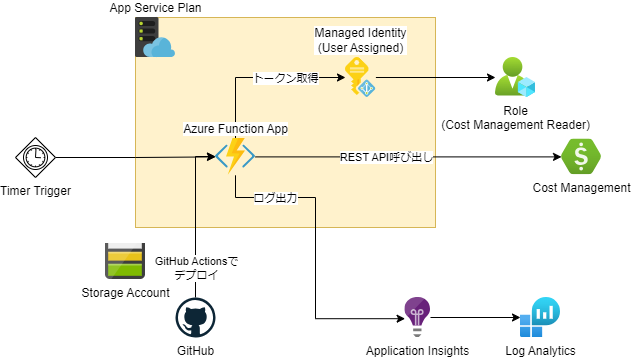

# azure-notify-costreport-for-slack-infra
## 機能
Azureのコスト分析をSlackに通知する。

当月の合計・当月日ごとの合計・当月日ごとサービスごとの合計を通知。

当月日ごとサービスごとの合計は全日出すと長すぎるので、直近10日間のみ。

当リポジトリにはAzure Functionsのソースコードは含んでいない。[Azure Functionsのソース](https://github.com/jinka1997/azure-notify-costreport-for-slack-function)を参照すること。

## 構成

## バージョン
以下バージョンでの動作確認をしています。
- Terraform v1.5.4
- azurerm v3.71.0

## 実行
以下の通り実行すると、東日本リージョンに`rg-costreport-{ランダム文字列}`のリソースグループが作成され、このリソースグループ内にすべてのリソースが作成されます。

1. リポジトリClone後に、`terraform.tfvars`を作成する
    - incoming webhookで作成した、Slack通知先のURLを指定
1. Azureにサインイン
1. `terraform init`を実行
1. `terraform plan`を実行
1. エラーが出なければ、`terraform apply`を実行
1. ソースコードから、Azure Functionsにデプロイ
